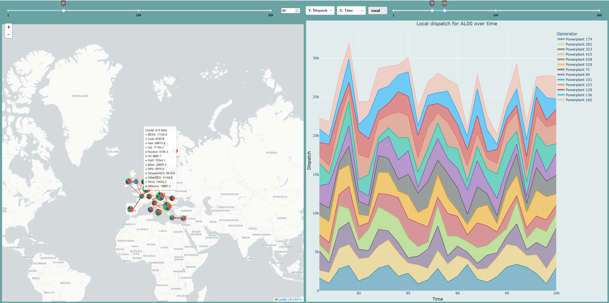

# GraphPlottingTool
An interactive Python tool to visualize results from power system optimization.

## Features
- **Interactive Map Visualization**: Displays network data using Dash Leaflet, including power flow lines and nodes with pie chart visualizations.
- **Dynamic Plotting**: Generates customizable plots (line, bar, histogram) for analyzing power flow, dispatch, and other metrics.
- **Time Navigation**: Includes sliders and range selectors for exploring data across different time steps.
- **Local and Global Scope**: Toggle between local and global views for detailed or aggregated data analysis.
- **Customizable Layout**: User-friendly interface with dropdowns, sliders, and buttons for selecting axes, time ranges, and visualization options.
- **Clustered Node Representation**: Groups nodes into clusters with aggregated visualizations for better scalability.
- **Configurable Options**: Supports YAML-based configuration for input data, map settings, and graph options.

## Modules
- **`GraphPlottingTool`**: Main class for initializing and running the Dash application.
- **`ui_handler`**: Handles UI components like network maps, dynamic plots, and data filtering.
- **`MarkerJS`**: Provides JavaScript functions for rendering custom markers and clusters on the map.
- **`plot_definitions`**: Defines plotting logic for generating visualizations using Plotly.
- **`helper_functions`**: Utility functions for configuration management and data extraction.
- **`data_loader`**: Loads and processes input data from SQLite or other supported formats.

## Example


## Getting Started
1. Clone the repository.
2. Install dependencies using the provided `environment.yml` file.
3. Run the application:
   ```bash
   python GraphPlottingTool.py